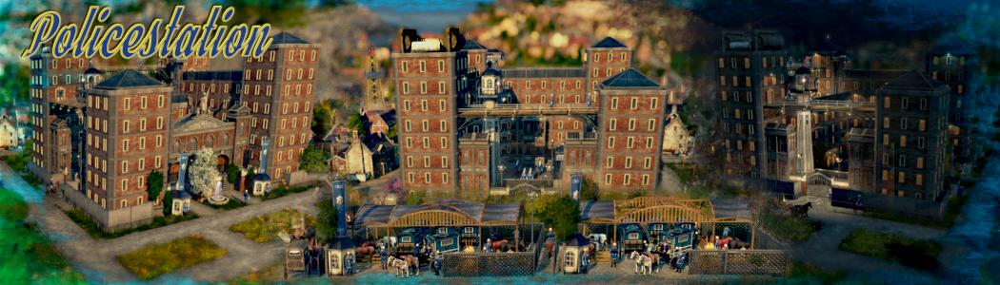

# MU_Anno1800_Mod_Collection

muggenstuermers mod collection-all up to date in one place.
still in rework process,pls be patient,thx

[A_Modified_Ornaments_Tab_MU](https://github.com/muggenstuermer/MU_Anno1800_Mod_Collection/tree/main#a_modified_ornaments_tab_mu)

[Shared_Objects_MU](https://github.com/muggenstuermer/MU_Anno1800_Mod_Collection/tree/main#shared_objects_mu)

[Fire_Station_MU](https://github.com/muggenstuermer/MU_Anno1800_Mod_Collection/tree/main#fire_station_mu)

[Hospital_MU](https://github.com/muggenstuermer/MU_Anno1800_Mod_Collection/tree/main#hospital_mu)

[Immigrants_And_Their_Fields_MU](https://github.com/muggenstuermer/MU_Anno1800_Mod_Collection/tree/main#immigrants_and_their_fields_mu)

[Marketplaces_MU](https://github.com/muggenstuermer/MU_Anno1800_Mod_Collection/tree/main#marketplaces_mu)

[Police_Station_MU](https://github.com/muggenstuermer/MU_Anno1800_Mod_Collection/tree/main#police_station_mu)

[Rockefellers_Dream_MU](https://github.com/muggenstuermer/MU_Anno1800_Mod_Collection/tree/main#rockefellers_dream_mu)

[Skyline_New_Era_MU](https://github.com/muggenstuermer/MU_Anno1800_Mod_Collection/tree/main#skyline_new_era_mu)

[Tourists_Alternativ_Buildings_MU](https://github.com/muggenstuermer/MU_Anno1800_Mod_Collection/tree/main#tourists_alternativ_buildings_mu)

[Worlds_New_Depots_MU](https://github.com/muggenstuermer/MU_Anno1800_Mod_Collection/tree/main#worlds_new_depots_mu)

## `A_Modified_Ornaments_Tab_MU`

To get the vanilla building menu appearance for the ornaments, the Arctic and Enbesa also got an ornaments menu.
I have added a separate mods and harbour tab.

The existing categories don't really offer much space for mods, and the number of mods is constantly increasing.
I was also missing the possibility of sorting port ornaments in a meaningful way, because not every port is industrial.

This new menu can be used by other modders, and is basically desirable, as long as it fits into these categories and wants to be used.

New Ornaments Tabs

- 1337505000 Ornaments Categorie OW/Mods Tab
- 1337505001 Ornaments Categorie NW/Mods Tab

- 1337505002 Ornaments Categorie Arctic/Classic Tab
- 1337505003 Ornaments Categorie Arctic/Season Tab
- 1337505004 Ornaments Categorie Arctic/Cosmetic Tab
- 1337505005 Ornaments Categorie Arctic/Special Tab
- 1337505006 Ornaments Categorie Arctic/Mods Tab

- 1337505007 Ornaments Categorie Arctic/Park Tab
- 1337505008 Ornaments Categorie Arctic/City Tab
- 1337505009 Ornaments Categorie Arctic/Industrial Tab

- 1337505010 Ornaments Categorie Africa/Classic Tab
- 1337505011 Ornaments Categorie Africa/Season Tab
- 1337505012 Ornaments Categorie Africa/Cosmetic Tab
- 1337505013 Ornaments Categorie Africa/Special Tab
- 1337505014 Ornaments Categorie Africa/Mods Tab

- 1337505015 Ornaments Categorie Africa/Park Tab
- 1337505016 Ornaments Categorie Africa/City Tab
- 1337505017 Ornaments Categorie Africa/Industrial Tab

xxxxxxxxxxxxxxxxxxxxxxxxxxxxxxxxxxxxxxxxxxxxxxxxxxxx

New Harbor Tabs

- 1337505018 Harbor Tab OW
- 1337505019 Harbor Tab NW
- 1337505020 Harbor Tab Arctic
- 1337505021 Harbor Tab Africa

[Download latest A_Modified_Ornaments_Tab_MU Release](https://github.com/muggenstuermer/MU_Anno1800_Mod_Collection/releases/latest)

## `Shared_Objects_MU`

This mod will provide shared objects and files that can be used by different mods and developers in the future 

and will be used by me for several mods.

[Download latest Shared_Objects_MU Release](https://github.com/muggenstuermer/MU_Anno1800_Mod_Collection/releases/latest)

## `Fire_Station_MU`

This mod adds 2 more fire stations.

### The Fire Brigade Institute:

- Reach of the emergency forces (compared to the original) : +8%.
- Emergency forces ( compared to the original ) : +300% (4 units).
- Emergency forces Movement rate (compared to the original) : +30%.
- Emergency forces Execution speed (compared to the original) : +100%.
- Reduces the risk of fire (compared to the original) : +45%.
- Range of fire reduction (compared to the original) : +60%.

### The Volunteer Firefighter:

- Reach of the emergency forces (compared to the original) : -16%.
- Emergency forces ( compared to the original ) : +100% (2 units).
- Emergency forces Movement rate (compared to the original) : +15%.
- Emergency forces Execution speed (compared to the original) : +50%.
- Reduces the risk of fire  (compared to the original) : -3%.
- Range of fire reduction (compared to the original): -15%.

The buildings were integrated into the original building menu of the fire station.

### Recommended active mods :

- ["Spice_Harborlife" by @Taubenangriff](https://mod.io/g/anno-1800/m/harborlife)

For the Harbor a seperated menu is created,straight after SPIU-Harborlife.Main icon is taken from @Jakobs mod "Compact Build Menus" and modified.

Ranges could be changed with [IMYA](https://github.com/anno-mods/iModYourAnno)

[Download latest Fire_Station_MU Release](https://github.com/muggenstuermer/MU_Anno1800_Mod_Collection/releases/latest)

## `Hospital_MU`

This mod adds 2 more hospitals / doctors.

### The Sanatorium::

- Deployed forces range ( compared to the original ) : +8%.
- Task forces ( compared to the original ) : +100% (4 units).
- Force movement rate ( compared to original ) : +30%.
- Deployment rate ( compared to the original ) : +100%.
- Reduced sickness ( compared to original ) : +45%.
- Range disease reduction ( compared to original ) : +60%.

### The alternative Practitioners:

- Task force range ( compared to the original ) : -16%.
- Task forces ( compared to original ) : +50% (3 units).
- Force movement rate ( compared to original ) : +15%.
- Deployment rate ( compared to the original ) : +50%.
- Reduced sickness ( compared to original ) : -3%.
- Range disease reduction ( compared to original ) : -15%.

The buildings have been integrated into the original tree menu of the hospital.

### Recommended active mods :

- ["Spice_Harborlife" by @Taubenangriff](https://mod.io/g/anno-1800/m/harborlife)

For the Harbor a seperated menu is created,straight after SPIU-Harborlife.

Ranges could be changed with [IMYA](https://github.com/anno-mods/iModYourAnno)

[Download latest Hospital_MU Release](https://github.com/muggenstuermer/MU_Anno1800_Mod_Collection/releases/latest)

## `Immigrants_And_Their_Fields_MU`

This mod brings a new population into the game, the "immigrants".

They have no great demands and are mostly self-supporters.
They grow what they need to survive themselves with the ornamental fields they bring with them.

They are warmly welcomed and gladly offer their "peasant" labour.

There is room for up to 36 family members in their small huts. after all, they know each other :) .

They designed and built their public buildings themselves, and they are particularly proud of that.

Who knows, but maybe one or the other immigrant will discover his talent for the economy and open a place of work, who knows?

### Necessary active mods :

- ["A_Modified_Ornaments_Tab" by @muggenstuermer](https://github.com/muggenstuermer/MU_Anno1800_Mod_Collection/releases/latest)

- ["Shared_Objects_MU" by @muggenstuermer](https://github.com/muggenstuermer/MU_Anno1800_Mod_Collection/releases/latest)

- ["Streets_Related_MU" by @muggenstuermer](https://github.com/muggenstuermer/MU_Anno1800_Mod_Collection/releases/latest)

Ranges could be changed with [IMYA](https://github.com/anno-mods/iModYourAnno)

[Download latest Immigrants_And_Their_Fields_MU Release](https://github.com/muggenstuermer/MU_Anno1800_Mod_Collection/releases/latest)

## `Marketplaces_MU`

This mod contains all Markets from City and Harbour Ornaments 
and adds some skins to the original Market and also for the Harborlife Markets.

They are available as functional and ornamental buildings,
have diffrent sizes and diffrent ranges and are adapted to the respective regions.

### Necessary active mods :

- ["A_Modified_Ornaments_Tab" by @muggenstuermer](https://github.com/muggenstuermer/MU_Anno1800_Mod_Collection/releases/latest)

- ["Shared_Objects_MU" by @muggenstuermer](https://github.com/muggenstuermer/MU_Anno1800_Mod_Collection/releases/latest)

- ["Spice_Harborlife" by @Taubenangriff](https://mod.io/g/anno-1800/m/harborlife)

Ranges could be changed with [IMYA](https://github.com/anno-mods/iModYourAnno)

[Download latest Marketplaces_MU Release](https://github.com/muggenstuermer/MU_Anno1800_Mod_Collection/releases/latest)

## `Police_Station_MU`

This mod adds 2 more police stations.

### The State Prison:

- Force range ( compared to the original ) : +8%.
- Force ( compared to the original ) : +300% (4 units).
- Force movement rate ( compared to original ) : +30%.
- Force execution speed ( compared to the original ) : +100%.
- Reduces riots ( compared to original ) : +45%
- Range Insurgency Reduction ( compared to original ) : +60%.

### The Mobile Task Force:

- Task force range ( compared to the original ) : -16%.
- Task Force ( compared to the original ) : +100% (2 units).
- Force movement rate ( compared to original ) : +15%.
- Force execution speed ( compared to the original ) : +50%.
- Reduces riots ( compared to original ) : -3%
- Range Insurgency Reduction ( compared to original ) : -15%.

The buildings have been integrated into the original building menu of the police station.

### Recommended active mods :

- ["Spice_Harborlife" by @Taubenangriff](https://mod.io/g/anno-1800/m/harborlife)

For the Harbor a seperated menu is created,straight after SPIU-Harborlife.

Ranges could be changed with [IMYA](https://github.com/anno-mods/iModYourAnno)

[Download latest Police_Station_MU Release](https://github.com/muggenstuermer/MU_Anno1800_Mod_Collection/releases/latest)

# `Rockefellers_Dream_MU`

This mod provides a complete shopping mall which can be covered with glass roofs.
All department stores as underground buildings are also available for the OW.
For SPIU-Harborlife Lovers : they are also available for the water and as an ornament.

### Existing functional buildings:

- Underground department store / with and without roof / with and without open passage inclusive 3 skins
- Underground furniture store / with and without roof / with and without open passage inclusive 3 skins
- Underground drug store / with and without roof / with and without open passage inclusive 3 skins

- Palace style department store inclusive 2 skins inclusive ornamental variant
- Palace style furniture store inclusive 2 skins inclusive ornamental variant
- Palace style drug store inclusive 2 skins inclusive ornamental variant

- Palace style Restaurant inclusive 2 skins inclusive ornamental variant
- Palace style Cafe inclusive 2 skins inclusive ornamental variant
- Palace style Bar inclusive 2 skins inclusive ornamental variant
- Palace style Hotel inclusive 2 Skins inclusive ornamental Variant
- Palace style Investors inclusive 2 skins inclusive ornamental variant

- Palace style warehouse inclusive 2 skins

- Complete glass roof set to create a canopy. Optionally with supports, pillars or both.

- Where no skin symbol appears in the UI, the skins can also be changed with the brush from the building menu.
	

## Building aid using the example of a cross:

## Preface :

- The buildings connect to each other automatically,except for the warehouses !
- In order to be able to place a glass roof, the buildings have a free area in the middle that can be built over. ( 3x3 building area )
- The glass roofs have different numbers of 1x1 building areas, depending on size and shape.
  These can be built over to support all possible building variations.
- We have tried to cover all possible building variations with the glass roofs.
  Should a possibility arise during the game that cannot be covered with glass roofs, please send me a screenshot of it, thank you.
- Because of the roofing,the construction method with terrain adjustment was chosen.

## Building description :

- In order to be able to place a glass roof, the opposite buildings need a distance of "3" fields to each other.
  This creates a "tunnel" that is 3 fields wide.
  This is the width that is covered by the glass roofs.
- This 3-field rule must also be observed at corners and intersections!
- Crossings are not possible with the functional buildings because of the road connection.
  These can only be created with an additional ornamental building!
- The ends of the "cross" can also be completely designed with the different warehouses.
  These all have a double passageway.
- It is recommended that the "tunnel" be completely finished (roads, ornaments, etc.) before the glass roof is placed as the final element.
  Exceptions are the glass roofs which place a construction area exactly at a passage.
  In these cases, please build the glass roof first, because this construction area can be built over.

### Necessary active mods :

- ["A_Modified_Ornaments_Tab" by @muggenstuermer](https://github.com/muggenstuermer/MU_Anno1800_Mod_Collection/releases/latest)

- ["Shared_Objects_MU" by @muggenstuermer](https://github.com/muggenstuermer/MU_Anno1800_Mod_Collection/releases/latest)
	  
	  
### Recommended active mods :

- ["Streets_Related_MU" by @muggenstuermer](https://github.com/muggenstuermer/MU_Anno1800_Mod_Collection/releases/latest)
  - The roundabouts look really good in a shopping centre ;)

- ["Spice_Harborlife" by @Taubenangriff](https://mod.io/g/anno-1800/m/harborlife)

Ranges could be changed with [IMYA](https://github.com/anno-mods/iModYourAnno)

[Download latest Rockefellers_Dream_MU Release](https://github.com/muggenstuermer/MU_Anno1800_Mod_Collection/releases/latest)

## `Skyline_New_Era_MU`

Skyscrapers now get the 3 existing skinpacks from Vibrant Citys in their full extent.
For technical reasons, changing the skins of the skyscrapers is only possible as a variation change, shift+V !

### The Skyscrapers:

They always follow this pattern in the order:

- first : Original building ( no matter what height and composition ).
- second : "Brick" skin.
- third : "Nightlife" skin.
- last : "Colourful" skin.

### The Malls:

In addition, this mod provides all malls in skyscraper optics, which initially resemble a construction site.

- Department Store
- Furniture Store
- Drug Store

All "house"-malls heights and skins,can be changed via the skin system.

- Lvl 1 with 1 floor with possible skins : Original,Brick,Nightlife,Colourful
- Lvl 2 with 2 floors with possible skins : Original,Brick,Nightlife,Colourful
- Lvl 3 with 3 floors with possible skins : Original,Brick,Nightlife,Colourful
- Lvl 4 with 4 floors with possible skins : Original,Brick,Nightlife,Colourful
- Lvl 5 with 5 floors with possible skins : Original,Brick,Nightlife,Colourful

Recipes as well as the department stores are unlocked like the original.

The area of effect has been lowered from 45 to 25.

FullSatisfactionDistance and NoSatisfactionDistance have been halved.

All mall buildings will be available as ornaments for land and water and will bring different neon lights.

### The Warehouse:

You will find also a warehouse in same style with a passage for a street in the middle.

its upgradeable, and it changes its height with each upgrade.

skins from the warehouse could be changed with the skin brush from the buildmenu.

### Recommended active mods :

- ["Spice_Harborlife" by @Taubenangriff](https://mod.io/g/anno-1800/m/harborlife)

The functional buildmenus will follow Harborlife

Ranges could be changed with [IMYA](https://github.com/anno-mods/iModYourAnno)

[Download latest Skyline_New_Era_MU Release](https://github.com/muggenstuermer/MU_Anno1800_Mod_Collection/releases/latest)

## `Tourists_Alternativ_Buildings_MU`

This mod adds alternative skins for the hotel, bar and café.

It also features new bus stops with and without passages, and a pedestrian overpass with a spiral staircase, also for the water.

It also adds a historic train station, “Historic Station Warehouse”, which takes on the function of a warehouse to improve the cityscape somewhat.also available on the water.

And there are also 2 types of passages....yes,also possible on the water :)

### Historic Station Warehouse Buff:

- max. +105 more tourists
- each +15 more through:
	- Tourist harbour
	- Restaurants
	- Variety
	- Café
	- Bar
	- Jam
	- Shampoo
	
- Bars / restaurants / cafés / all shopping arcades / all chemical factories :
	- +15% higher production
	- -25% labour force

### Historic Station Warehouse Building:

- at the sides there is space for 3 rail entrances and exits (or roads, as you like)
- in the middle of each of the main entrances for a street (or whatever you prefer)

### Passages :

- one for double roads
- one for single streets

### Bus Stations:

- there are a large number of bus stops and many variants of them
- some of them have passages for singel and double streets
- the spiral staircases are accessible in first person mode
- one variant fits well between non-updated investor apartments

### Necessary active mods :

- ["Shared_Objects_MU" by @muggenstuermer](https://github.com/muggenstuermer/MU_Anno1800_Mod_Collection/releases/latest)

Ranges could be changed with [IMYA](https://github.com/anno-mods/iModYourAnno)

[Download latest Tourists_Alternativ_Buildings_MU Release](https://github.com/muggenstuermer/MU_Anno1800_Mod_Collection/releases/latest)

# MuggenTours_MU

This mod adds two trolleybus skins, a double decker bus and a convertible bus skin.

Furthermore, this mod replaces the central power poles with poles placed at the roadside and power lines that have lighting with hanging lights.
	

don't take this mod too seriously ;)
	
	
	
## ATTENTION!!

## NOT COMPATIBLE WITH SPIU : [Ornamental] Electric Lighting instead of Electricity Wires.

## This MUST be deactivated !

	
Have fun with it: your muggenstuermer ;)

	
https://github.com/muggenstuermer/MU_Anno1800_Mod_Collection/releases/latest

## `Worlds_New_Depots_MU`

Based on the industry dlc, this mod offers the possibility to build an upgradeable "storage" city with modified dockland modules.
"Speicher"-city", and thus to create an "industrial district".
It is possible to build depots on land and water in the Old World, New World, Arctic and Enbesa.

Optically matching, warehouses with a passage are included.
(original model originally comes from @Jacob,and was modified and used with his permission,thanks for that) 
	
Everything is unlocked together with the storage city from the Docklands DLC.

### The Depots:

Possibility to upgrade them in 3 stages. They grow in height.

With the exception of the arctic, all regions contain a possible skin change :

	- Docklands Original for the Old World
	- New World skin from the mod "New World Docklands".
	- Enbesa skin from the mod "New World Docklands".

For the Arctic, the texture from the "Winter" mod by @Lirvan was used.

https://www.nexusmods.com/anno1800/mods/311

Since he also gave us the possibility to create them ourselves with his tools,
I see no problem and thank him very much for that.
I couldn't manage to create it myself :( .

The Depots have the following storage capacities:
	- LvL 1 has 30t
	- LvL 2 has 65t
	- LvL 3 has 105t
	- LvL 4 has 150t

### The Underground Depots:

This mod also comes with an underground depot.
You can observe what is happening underground through the glass dome.

You can select the desired skin :

	- Adapted to Docklands for the Old World
	- Adapted to the mod "New World Docklands" for the New World
	- Adapted to the mod "New World Docklands" for Enbesa
	- Adapted to the mod "New World Docklands" for Arctic
	
The underground depots have a storage capacity of 30t per object and are not upgradeable.
	
	
### The Warehouses:

Possibility to upgrade them in 3 stages. They grow in height.

The warehouses are identical to the vanilla building when upgraded:

	- LvL 1 has 2 loading ramps
	- Lvl 2 has 3 loading ramps
	- Lvl 3 has 4 loading ramps
	- Lvl 4 has 6 loading ramps
	
### The Warehouse and Depot Special:

This building was the result of a user's wish.
it is possible to build a road x crossing under the building.

Otherwise, the buildings are just like the warehouse or the depots.

### Necessary active mods:

- ["New World Docklands" by @Kurila](https://mod.io/g/anno-1800/m/new-world-dockland-kurila)

- ["Shared_Objects_MU" by @muggenstuermer](https://mod.io/g/anno-1800/m/sharedobjectsmu)

# Recommended active mods:

- ["Spice_Arctic Quay" by @Taubenangriff](https://mod.io/g/anno-1800/m/arctic-quay)

- ["Streets_Related_MU" by @muggenstuermer](https://mod.io/g/anno-1800/m/streetsrelatedmu)

Ranges could be changed with [IMYA](https://github.com/anno-mods/iModYourAnno)

[Download latest Worlds_New_Depots_MU Release](https://github.com/muggenstuermer/MU_Anno1800_Mod_Collection/releases/latest)

# Streets_Related_MU

This mod will contain all my mods in the future, which are directly related to the theme "streets".
Street mods from City_Ornaments or Harbour_Ornaments will follow.

contains:
	- known streets and street related parts from City_Ornaments_MU_2
	- bridges for different possibilities - road bridges - pedestrian bridges - railway bridges
	- water channels and their bridges
	- a modular lake,which can be used under all bridges ,pedestrian bridges excluded ( hinders the use of the bridge by feedback )
	- invisible Harbour_Ornaments_MU_2 content - affects construction of roads from land to water
	- roundabouts in the NW matches to Jakob's Improved Streets mod.
	- the regions have all their own roundabouts

## Required active mods :
---------------------	
"Shared_Objects_MU" by @muggenstuermer
https://github.com/muggenstuermer/MU_Anno1800_Mod_Collection/releases/latest

"Improved Streets" by @Jakob with activated rails modification
https://github.com/jakobharder/anno-1800-jakobs-mods/releases/latest

	
https://github.com/muggenstuermer/MU_Anno1800_Mod_Collection/releases/latest

# Green_Mile_MU

This mod contains all trees and plants from City and Harbour_Ornaments and have been reworked.

To maintain the vanilla build menu appearance for the ornaments, the Arctic and Enbesa have also received an ornaments tab.

I have added a separate mods tab.

This new menu may be used by other modders, and is basically desired, as long as it fits into this section.

## Required active mods :
---------------------	
"Shared_Objects_MU" by @muggenstuermer
https://github.com/muggenstuermer/MU_Anno1800_Mod_Collection/releases/latest

---------------------------
Release - 1.0
---------------------------

---------------------------
Changelog - 1.1
---------------------------
	- Tweak possibility for attractiveness added.
