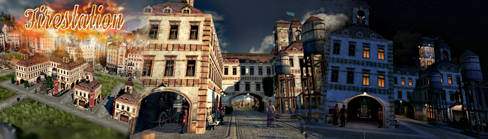

# Fire_Station_MU

This mod adds 2 more fire stations.

### The Fire Brigade Institute:

- Reach of the emergency forces (compared to the original) : +8%.
- Emergency forces ( compared to the original ) : +300% (4 units).
- Emergency forces Movement rate (compared to the original) : +30%.
- Emergency forces Execution speed (compared to the original) : +100%.
- Reduces the risk of fire (compared to the original) : +45%.
- Range of fire reduction (compared to the original) : +60%.

### The Volunteer Firefighter:

- Reach of the emergency forces (compared to the original) : -16%.
- Emergency forces ( compared to the original ) : +100% (2 units).
- Emergency forces Movement rate (compared to the original) : +15%.
- Emergency forces Execution speed (compared to the original) : +50%.
- Reduces the risk of fire  (compared to the original) : -3%.
- Range of fire reduction (compared to the original): -15%.

The buildings were integrated into the original building menu of the fire station.

Ranges could be changed with [IMYA](https://github.com/anno-mods/iModYourAnno)

[Download latest Fire_Station_MU Release](https://github.com/muggenstuermer/MU_Anno1800_Mod_Collection/releases/latest)

## Changelogs

---------------------------
Changelog - 1.1
---------------------------

	- correction of assets.xml for better compatibility with spice it up and availability in Enbesa upon request.

---------------------------
Changelog - 1.2
---------------------------

	- GU16 Bugfixing and adjustment of various values.
	- preparations for value changes by iModYourAnno ModManager: https://github.com/anno-mods/iModYourAnno/releases
	- various values can be changed by a slider.
	- the fire brigade institute now moves out with motorised units.
	- Polish translation added.

---------------------------
changelog - 1.22
---------------------------

	- added missing translations of single objects.

---------------------------
Changelog - 1.23
---------------------------

	- GU17 modinfo.json correction.

---------------------------
Changelog - 1.24
---------------------------

	- modinfo.json correction.

---------------------------
Changelog - 1.25
---------------------------

	- correction ifo files.
	- IMYA tweaks added to be able to set limited custom ranges.
	- correction of the folder structure to adapt to the desired structures.
	- chinese translation added. Big thx to @darknesswei for this translation
	- reduce content.txt files to english only.
	
	
	
[Part of MU_Anno1800_Mod_Collection](https://github.com/muggenstuermer/MU_Anno1800_Mod_Collection)