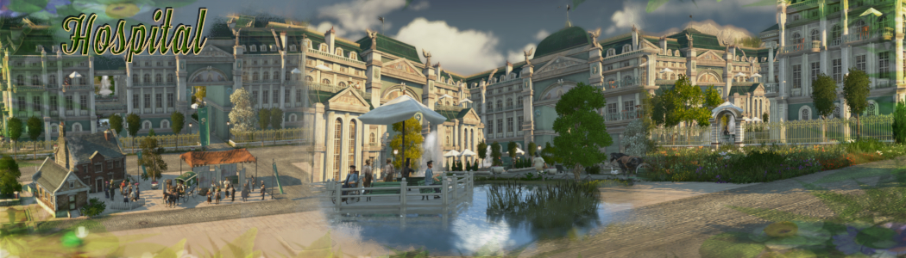

# Hospital_MU

This mod adds 2 more hospitals / doctors.

### The Sanatorium::

- Deployed forces range ( compared to the original ) : +8%.
- Task forces ( compared to the original ) : +100% (4 units).
- Force movement rate ( compared to original ) : +30%.
- Deployment rate ( compared to the original ) : +100%.
- Reduced sickness ( compared to original ) : +45%.
- Range disease reduction ( compared to original ) : +60%.

### The alternative Practitioners:

- Task force range ( compared to the original ) : -16%.
- Task forces ( compared to original ) : +50% (3 units).
- Force movement rate ( compared to original ) : +15%.
- Deployment rate ( compared to the original ) : +50%.
- Reduced sickness ( compared to original ) : -3%.
- Range disease reduction ( compared to original ) : -15%.

The buildings have been integrated into the original tree menu of the hospital.

For the Harbor a seperated menu is created,straight after SPIU-Harborlife.

### Recommended active mods :

- ["Spice_Harborlife" by @Taubenangriff](https://mod.io/g/anno-1800/m/harborlife)

Ranges could be changed with [IMYA](https://github.com/anno-mods/iModYourAnno)

[Download latest Hospital_MU Release](https://github.com/muggenstuermer/MU_Anno1800_Mod_Collection/releases/latest)

## Changelogs

---------------------------
Changelog - 1.1
---------------------------
	- correction of assets.xml for better compatibility with spice it up and availability in Enbesa upon request.

---------------------------
Changelog - 1.2
---------------------------
	- GU16 Bugfixing and adjustment of various values.
	- preparations for value changes by iModYourAnno ModManager: https://github.com/anno-mods/iModYourAnno/releases
	- various values can be changed by a controller.
	- the sanatorium now moves out with motorised units.
	- Polish added.

---------------------------
changelog - 1.22
---------------------------
	- added missing translations of single objects
	
---------------------------
Changelog - 1.23
---------------------------
	- GU17 modinfo.json correction.
	
---------------------------
Changelog - 1.24
---------------------------
	- modinfo.json correction.

---------------------------
Changelog - 1.25
---------------------------
	- correction ifo files.
	- IMYA tweaks added to be able to set limited custom ranges.
	- correction of the folder structure to adapt to the desired structures.
	- chinese translation file added. Big thx to @darknesswei for this translation
	- korean translation file added. Big thx to @modpark817 for this translation
	- reduce content.txt files to english only.
	- SPIU-Harborlife support added
	
---------------------------
Changelog - 1.26
---------------------------
	- update README,modinfo.json and content_en.txt
	
---------------------------
Changelog - 1.3
---------------------------
	- added New Horizons support.
	
---------------------------
Changelog - 1.31
---------------------------
	- correction of object path.
	
	
	
[Part of MU_Anno1800_Mod_Collection](https://github.com/muggenstuermer/MU_Anno1800_Mod_Collection)