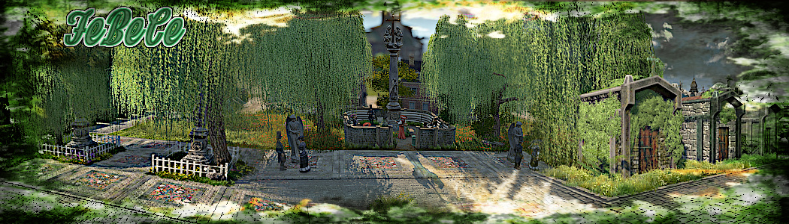

# Fe_Be_Ce_MU

This mod adds the missing benches, fences and cemetery accessories from CO2 in a modified form.

Furthermore it contains skins for the immigrant chapel, for the old world church (also for Harbor) and for the NW another chapel is integrated into the building menu.

Pretty much everything from the cemetery building menu is overbuildable, except for the sculptures and the fences.
so there are no limits to creativity

### Necessary active mods :

- ["A_Modified_Ornaments_Tab" by @muggenstuermer](https://mod.io/g/anno-1800/m/amodifiedornamentstabmu)

- ["Shared_Objects_MU" by @muggenstuermer](https://mod.io/g/anno-1800/m/sharedobjectsmu)

- ["Worlds_New_Depots_MU" by @muggenstuermer](https://mod.io/g/anno-1800/m/worldsnewdepotsmu)

### Recommended active mods :

- ["Spice_Harborlife" by @Taubenangriff](https://mod.io/g/anno-1800/m/harborlife)

- ["Immigrants_And_Their_Fields_MU" by @muggenstuermer](https://mod.io/g/anno-1800/m/immigrantsandtheirfieldsmu)

## Changelogs

---------------------------
Release - 1.0
---------------------------
	- Adding skins for immigrant chapel
	- Adding skins for OW Church
	- Adding small chapel to the NW Buildmenu
	- Adds covered and open Benches
	- Adds fence undergrounds and a bunch of fences and gates
	- Adds a graveyard walking trail, small rest and memorials 
	- Adds many singel and double graves,crypts and graveyard sculptures
	- Adds 2 overbuildable graveyard decals
	
	
[Part of MU_Anno1800_Mod_Collection](https://github.com/muggenstuermer/MU_Anno1800_Mod_Collection)