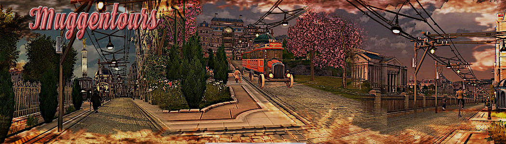

# MuggenTours_MU

This mod adds two trolleybus skins, a double decker bus and a convertible bus skin.

Furthermore, this mod replaces the central power poles with poles placed at the roadside and power lines that have lighting with hanging lights.

## Note

don't take this mod too seriously

### Incompatible mods :

- ["Electric Lighting (Spice It Up)" by @Taubenangriff](https://mod.io/g/anno-1800/m/electric-lighting)

- ["Streets and Railways (Jakob)" by @JakobsCollection](https://mod.io/g/anno-1800/m/jakob-improved-streets)

## Changelogs

---------------------------
Changelog - 1.1
---------------------------
	- GU16 Bugfixing.
	- Double-decker bus and convertible bus skin added.
	- Polish added.
	
---------------------------
Changelog - 1.11
---------------------------
	- GU17 modinfo.json correction.
	
	
	
[Part of MU_Anno1800_Mod_Collection](https://github.com/muggenstuermer/MU_Anno1800_Mod_Collection)