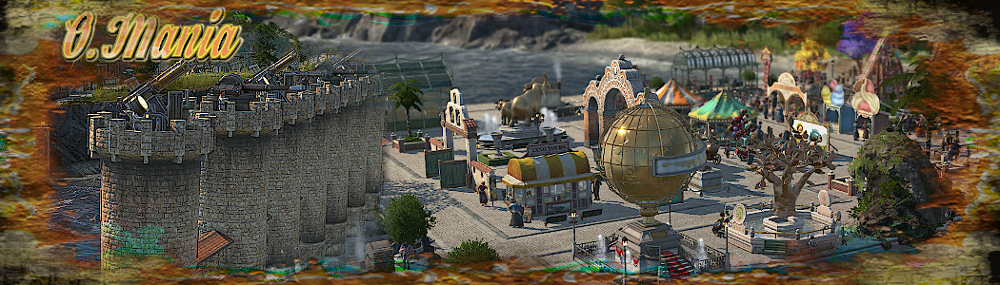

# Ornament_Mania_MU

Ornament_Mania_MU brings almost all noteworthy DLC and CDLC to all regions,Horai included.

These must be purchased and accessible.

In addition, all of these ornaments are also accessible in the harbour area.

The main focus was on making everything available.

The sense and nonsense of this is open to debate.

Everything is possible, but nothing is mandatory.

### Necessary active mods :

- ["A_Modified_Ornaments_Tab" by @muggenstuermer](https://mod.io/g/anno-1800/m/amodifiedornamentstabmu)

- ["Shared_Objects_MU" by @muggenstuermer](https://mod.io/g/anno-1800/m/sharedobjectsmu)

- ["Streets_Related_MU" by @muggenstuermer](https://mod.io/g/anno-1800/m/streetsrelatedmu)

### Recommended active mods :

- ["Pavements_MU" by @muggenstuermer](https://mod.io/g/anno-1800/m/pavements-mu)

- ["Green_Mile_MU" by @muggenstuermer](https://mod.io/g/anno-1800/m/greenmilemu)

- ["Fe_Be_Ce_MU" by @muggenstuermer](https://mod.io/g/anno-1800/m/fe-be-ce-mu)

## Changelogs

---------------------------
Release - 1.0
---------------------------

	
	
[Part of MU_Anno1800_Mod_Collection](https://github.com/muggenstuermer/MU_Anno1800_Mod_Collection)