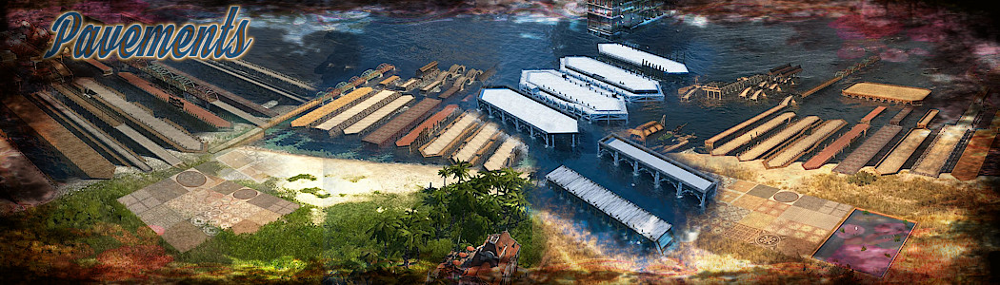

# Pavements_MU

This mod includes all floor tiles and all quays from CO2 and HO2.
The floor tiles on land can be built over, so all objects can be redesigned.
But there is one disadvantage: the blockers no longer work reliably.
There may be a second version of this in the future, in which the blockers are designed differently.

### Necessary active mods :

- ["A_Modified_Ornaments_Tab" by @muggenstuermer](https://mod.io/g/anno-1800/m/amodifiedornamentstabmu)

- ["Shared_Objects_MU" by @muggenstuermer](https://mod.io/g/anno-1800/m/sharedobjectsmu)

- ["Streets_Related_MU" by @muggenstuermer](https://mod.io/g/anno-1800/m/streetsrelatedmu)

### Recommended active mods :

- ["New Horizons" by @Taubenangriff](https://mod.io/g/anno-1800/m/new-horizons)

Ranges could be changed with [IMYA](https://github.com/anno-mods/iModYourAnno)

[Download latest Marketplaces_MU Release](https://github.com/muggenstuermer/MU_Anno1800_Mod_Collection/releases/latest)

## Changelogs

---------------------------
Release - 1.0
---------------------------

---------------------------
Changelog - 1.1
---------------------------
	- Hacienda pavement added
	- Added grass area for each region
	
---------------------------
Changelog - 1.2
---------------------------
	- GU17 modinfo.json correction.
	- The build menu is no longer scrollable due to a bug in GU17, therefore the build menu was splitted.
	  Bug because UBI itself has menus with more than 32 entries !
	  
---------------------------
Changelog - 1.3
---------------------------
	- Traditional terracotta pavement from CDLC 11 "Fiesta" added
	
---------------------------
Changelog - 1.4
---------------------------
	- only invisible quay added,because i need it for another mod on rework progress! (the mod itself is still under progress/rework)
	
---------------------------
Changelog - 1.5
---------------------------
	- added several Harbor Pavements to all Regions.
	
---------------------------
Changelog - 1.6
---------------------------
	- added singel snowtile to all Regions.
	
---------------------------
Changelog - 1.7
---------------------------
	- added New Horizons support.
	- mods that are in an InternalID conflict prevented from loading.
	
---------------------------
Changelog - 1.71
---------------------------
	- more arctic decals added.
	- added some decals from New Horizons mod (active NewHorizons is needed).
	
	
	
[Part of MU_Anno1800_Mod_Collection](https://github.com/muggenstuermer/MU_Anno1800_Mod_Collection)