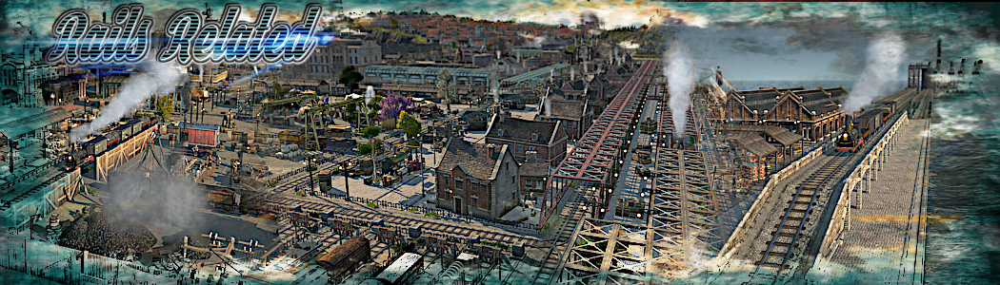

# Rails_Related_MU

This mod takes up the topic ‘rails’ and everything that has to do with it, it also allows the construction of rails on the water.
Because this mod explicitly addresses the harbour,some harbour-relevant objects are included.
Even if they do not directly fulfil the mod theme.

## Preface :

- The WaterRails building isnt 100% save.therefor they all have a quay as grounddecal.
- A pefekt Rails connection disables this grounddecal,and a missconnect will shown bei the railing of the quay (grounddecal).
- its also not 100% safe,but a continued connection,should always start in the dirction,the builded rails ends.
- tcrosses and xcrosses always fails.delet this part an buil it new,or drag it once out and drag it back.
- do not use the pickaxe to tear off individual rail parts, but select the part in question and use the remove button on your keyboard.
- i have created a how-to in video format for this mod, and i recommend watching it.
  it explains and illustrates the problems and some explanations on this topic . https://www.youtube.com/watch?v=ZY_o4fl3M7A
- since the how-to, the build menu has been updated and additional build menus have been added.
	
- Some Words :
  In february 2023 this all should be realised in a coop with @Valiiium.. but suddenly he disapeared and never answered to my mails again.
  In October 2024 @Lion started a mod with same theme.after consulting him,we decided to make coop togheter with our stuff..
  so i changed all my stuff and make new ones... but unfortunately @Lion is also missing at the moment, and is not responding to any of my contacts.
  i hope he is in the best of health and doing well.
  i would like to wait for him out of respect,but i've already built so much on it now, and involved other mods... i have to "pre" release that and hope nobody is upset about it.

### Necessary active mods :

- ["A_Modified_Ornaments_Tab" by @muggenstuermer](https://mod.io/g/anno-1800/m/amodifiedornamentstabmu)

- ["Shared_Objects_MU" by @muggenstuermer](https://mod.io/g/anno-1800/m/sharedobjectsmu)

- ["Streets_Related_MU" by @muggenstuermer](https://mod.io/g/anno-1800/m/streetsrelatedmu)

### Recommended active mods :

- ["Spice_Harborlife" by @Taubenangriff](https://mod.io/g/anno-1800/m/harborlife)

- ["Pavements_MU" by @muggenstuermer](https://mod.io/g/anno-1800/m/pavements-mu)

- ["Worlds_New_Depots_MU" by @muggenstuermer](https://mod.io/g/anno-1800/m/worldsnewdepotsmu)

- ["Marketplaces_MU" by @muggenstuermer](https://mod.io/g/anno-1800/m/marketplacesmu)

- ["Industrial Ornaments" by @HerrTurTur](https://mod.io/g/anno-1800/m/industrial-ornaments)

- ["Jakob's Industrial Cities, submod : jakob-railway-stations + models-railway-jakob" by @JakobsCollection](https://mod.io/g/anno-1800/m/jakob-industrial-cities)

## Changelogs

---------------------------
Release - 1.0
---------------------------
	- Adding several functional Rails for the Harbor and overbuildable Rails for the land
	- Adding several Rails related Ornaments
	- Adding Industrial Ornaments for Harbor and Land
	- Makes Bright Harvest and Industrial Zone Pack on Harbor Buildable
	- Adds new Harbor Oil Chain with new "Coke" Powerplant for land
	- brings the simple option for Offshore Oilpumps and Refinery
	- Adds Sheds for Land and Harbor as depots
	- rails on land can be covered with pavements from Pavements_MU. so you will be able to fit the rails to your citys. first build the pavement,than build the land rails from the mod,
	  after all,overbuild that all with the real railroad.
	  
---------------------------
Release - 1.1
---------------------------
	- Correct issue with coke icon
	
---------------------------
Changelog - 1.2
---------------------------
	- added New Horizons support.without "Coke" powerplant and the chain for it
	- Makes Bright Harvest and Industrial Zone Pack Buildable on Land + Harbor for New Horizons
	- dependence on third-party mods excluded.
	
---------------------------
Changelog - 1.3
---------------------------
	- Bright Harvest and Industrial Zone Pack for Harbor moved to new mod "Ornament_Mania_MU".
	
---------------------------
Changelog - 1.4
---------------------------
	- some code corrections on adding to pools.
	  

A big thank you goes to @Finchen.
she actively participated in the creation of the mod and checked it extensively for errors and improvements.
thanks @Finchen
	
	
	
[Part of MU_Anno1800_Mod_Collection](https://github.com/muggenstuermer/MU_Anno1800_Mod_Collection)